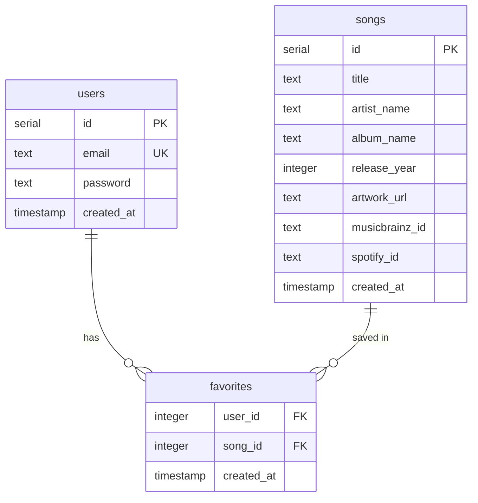

# Database Schema

PostgreSQL database schema for the Music Discovery App.
ORM: Drizzle ORM — schema defined in `packages/database/src/schema/`.

---

## Design Principles

- Only user-related data and user-selected songs are stored
- No full music catalog is stored locally
- Songs are stored as metadata snapshots only when a user favorites them
- Event data is NOT stored — fetched dynamically per request
- All tables use `serial` (auto-increment integer) primary keys

---

## Tables

### `users`

Stores registered user accounts.

| Column | Type | Constraints | Notes |
|---|---|---|---|
| `id` | `serial` | PRIMARY KEY | Auto-increment |
| `email` | `text` | NOT NULL, UNIQUE | Login identifier |
| `password` | `text` | NOT NULL | bcrypt hashed |
| `created_at` | `timestamp` | NOT NULL, DEFAULT NOW() | |

**Drizzle definition:** `packages/database/src/schema/users.ts`

---

### `songs`

Stores metadata snapshots of songs that have been favorited by at least one user.

| Column | Type | Constraints | Notes |
|---|---|---|---|
| `id` | `serial` | PRIMARY KEY | Auto-increment |
| `title` | `text` | NOT NULL | |
| `artist_name` | `text` | NOT NULL | |
| `album_name` | `text` | nullable | |
| `release_year` | `integer` | nullable | |
| `artwork_url` | `text` | nullable | Spotify CDN URL |
| `musicbrainz_id` | `text` | nullable | MusicBrainz recording UUID |
| `spotify_id` | `text` | nullable | Spotify track ID |
| `created_at` | `timestamp` | NOT NULL, DEFAULT NOW() | |

**Notes:**
- Songs are inserted via upsert (`onConflictDoNothing`) when a user favorites them
- `musicbrainz_id` is the primary external identifier used for deduplication
- Artwork URLs point to Spotify CDN — may expire

**Drizzle definition:** `packages/database/src/schema/songs.ts`

---

### `favorites`

Join table linking users to their favorited songs.

| Column | Type | Constraints | Notes |
|---|---|---|---|
| `user_id` | `integer` | NOT NULL, FK → users.id | |
| `song_id` | `integer` | NOT NULL, FK → songs.id | |
| `created_at` | `timestamp` | NOT NULL, DEFAULT NOW() | |

**Primary key:** composite `(user_id, song_id)`

**Relationships:**
- `user_id` → `users.id` (many-to-one)
- `song_id` → `songs.id` (many-to-one)
- A user can favorite many songs
- A song can be favorited by many users

**Drizzle definition:** `packages/database/src/schema/favorites.ts`

---

## Entity Relationship Diagram



---

## Migrations

Migrations are generated and run using Drizzle Kit.

```bash
# Generate a migration from schema changes
npm run db:generate --workspace=packages/database

# Apply migrations to the database
npm run db:migrate --workspace=packages/database

# Open Drizzle Studio (visual DB browser)
npm run db:studio --workspace=packages/database
```

Config: `packages/database/drizzle.config.ts`
Migrations output: `packages/database/src/migrations/`

---

## Drizzle Client

The database client is exported from `packages/database/src/client.ts` and consumed by backend services:

```ts
import { db } from '@app/database'
```

The `DATABASE_URL` environment variable must be set before the client initializes.

---

## Schema Rules

- Never define schema outside `packages/database/src/schema/`
- Never import Drizzle schema directly in the frontend
- All DB access must go through service functions — never in route handlers
- Use `eq`, `and`, `or` from `drizzle-orm` for query conditions
- Use `.returning()` after INSERT to get the created row back
- Use `.onConflictDoNothing()` for idempotent inserts
