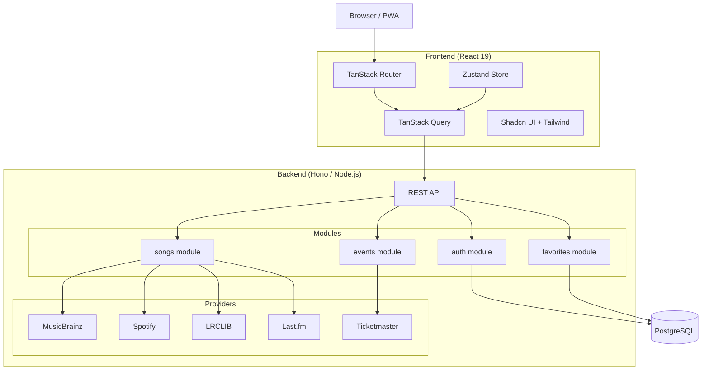
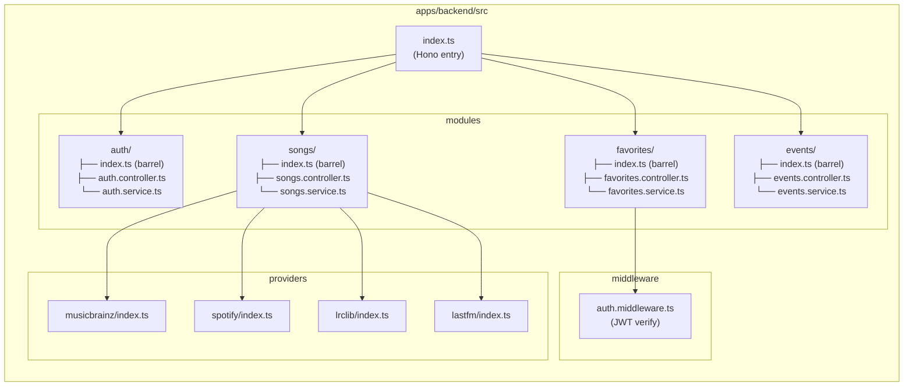
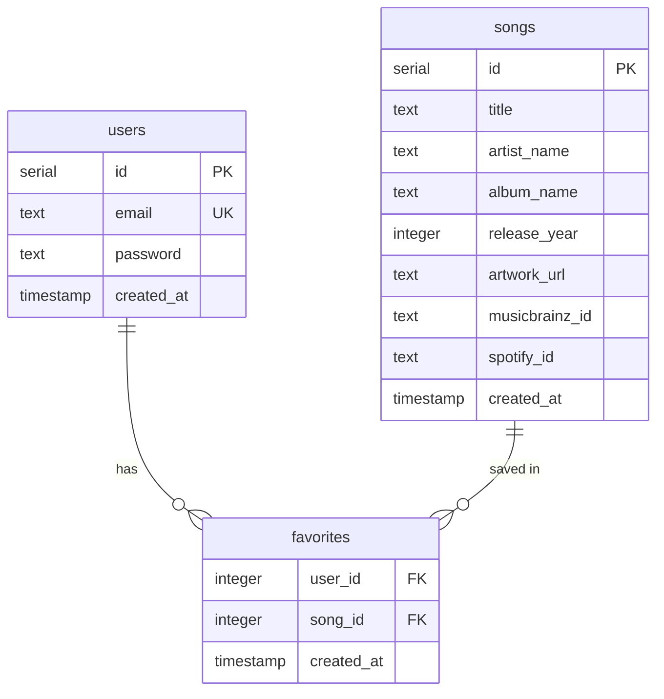
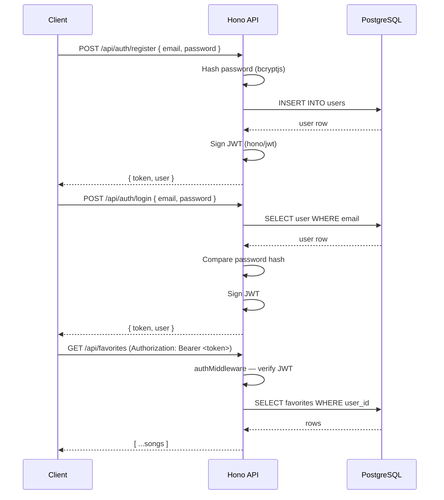
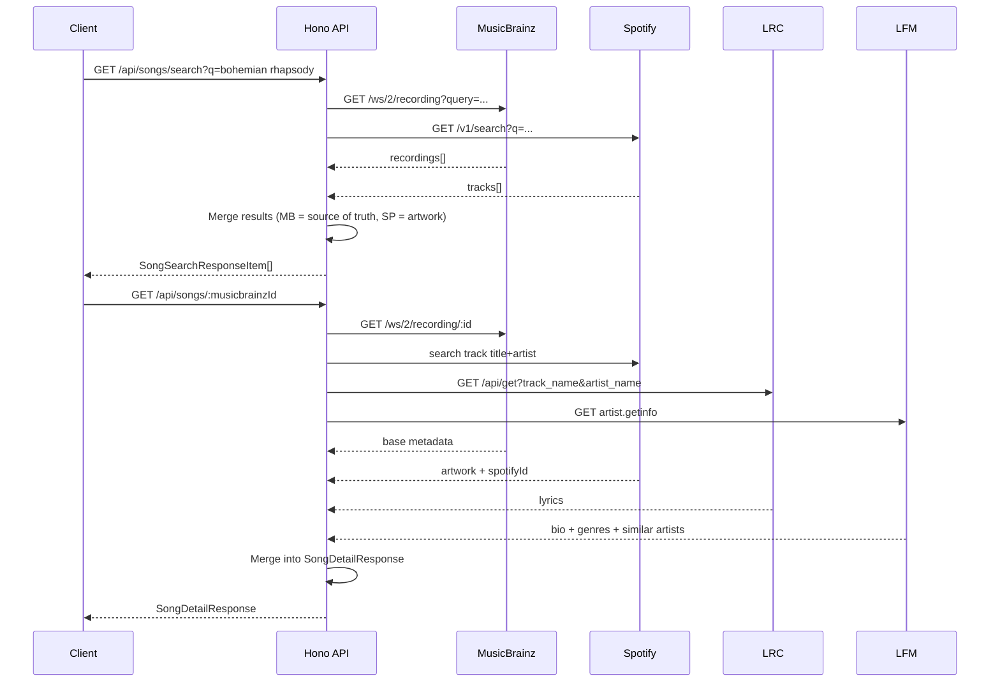
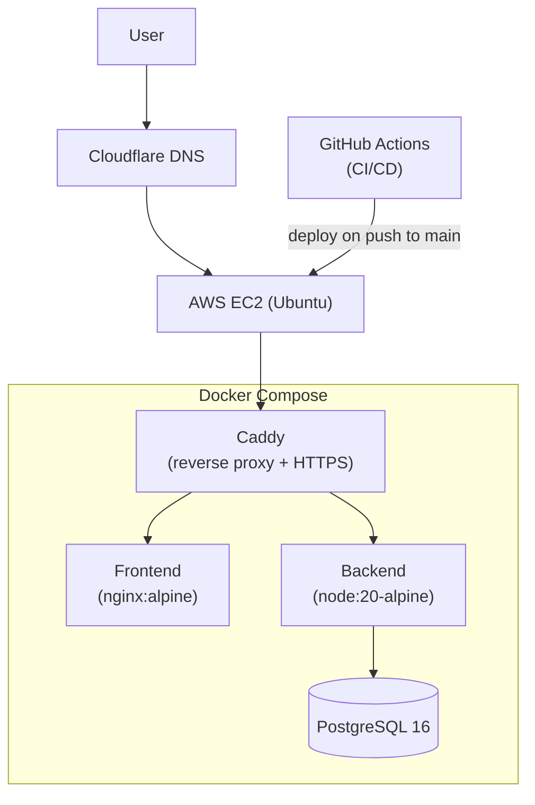

# Architecture Documentation

## 1. System Overview



---

## 2. Backend Module Structure



---

## 3. Database ERD



---

## 4. Authentication Flow



---

## 5. Song Search & Aggregation Flow



---

## 6. REST API Reference

### Auth

| Method | Route | Auth | Body | Response |
|---|---|---|---|---|
| POST | `/api/auth/register` | No | `{ email, password }` | `{ token, user }` |
| POST | `/api/auth/login` | No | `{ email, password }` | `{ token, user }` |

### Songs

| Method | Route | Auth | Params | Response |
|---|---|---|---|---|
| GET | `/api/songs/search` | No | `?q=string` | `SongSearchResponseItem[]` |
| GET | `/api/songs/:id` | No | `id` = MusicBrainz ID | `SongDetailResponse` |

### Favorites

| Method | Route | Auth | Body | Response |
|---|---|---|---|---|
| GET | `/api/favorites` | Yes (JWT) | — | `SongSearchResponseItem[]` |
| POST | `/api/favorites` | Yes (JWT) | `AddFavoriteRequest` | `{ success: true }` |
| DELETE | `/api/favorites/:songId` | Yes (JWT) | — | `{ success: true }` |

### Events

| Method | Route | Auth | Response |
|---|---|---|---|
| GET | `/api/events` | No | `MusicEvent[]` |

---

## 7. Type Architecture

Types are organized following Clean Architecture in `packages/shared/src/`:

```
packages/shared/src/
├── domain/          # Pure domain entities (framework-independent)
│   ├── song.ts      # Song
│   ├── user.ts      # User
│   └── event.ts     # MusicEvent
├── api/             # API contract DTOs (request/response shapes)
│   ├── auth.ts      # LoginRequest, RegisterRequest, LoginResponse
│   ├── songs.ts     # SongSearchResponseItem, SongDetailResponse, AddFavoriteRequest
│   └── events.ts    # EventListResponse
├── common/          # Shared utility types
│   └── result.ts    # ApiError, PaginatedResponse<T>
└── index.ts         # Barrel re-export
```

### Domain: Song
```ts
{
  title: string
  artistName: string
  albumName?: string
  releaseYear?: number
  artworkUrl?: string
  musicbrainzId: string
  spotifyId?: string
}
```

### API: SongDetailResponse
```ts
{
  song: Song
  lyrics?: string
  artistBio?: string
  genres?: string[]
  similarArtists?: string[]
  musicalKey?: string
}
```

### Domain: MusicEvent
```ts
{
  id: string
  name: string
  artist: string
  date: string        // ISO 8601
  venue: string
  ticketUrl?: string
  imageUrl?: string
}
```

### API: LoginResponse
```ts
{
  token: string
  user: { id: number, email: string }
}
```

---

## 8. Infrastructure Diagram


